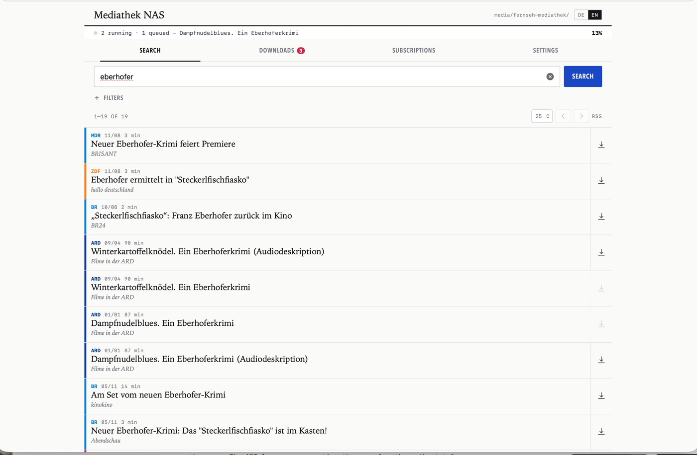
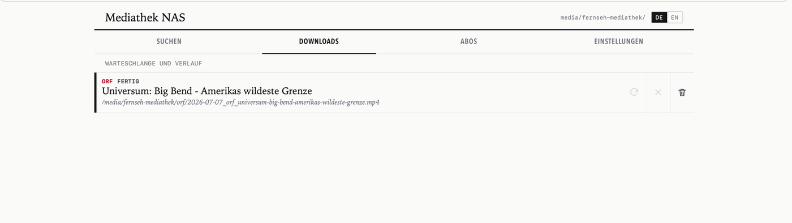
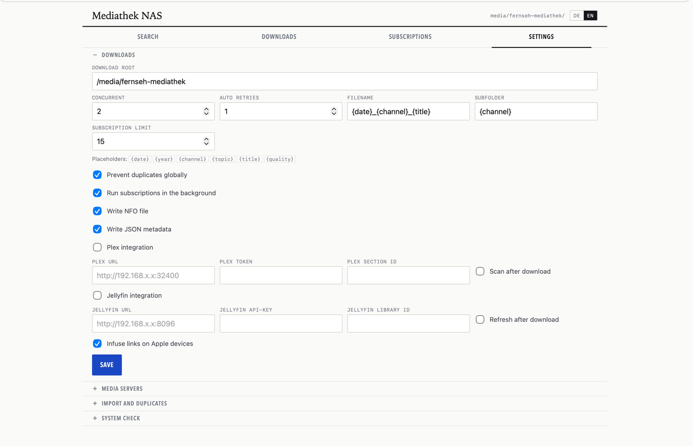

# Mediathek NAS

Eine selbst gehostete Web-App, die die Mediatheken der öffentlich-rechtlichen Sender
durchsucht und Sendungen direkt in die Medienbibliothek auf dem NAS lädt — benannt,
einsortiert und mit Metadaten versehen, sodass Plex, Jellyfin und Infuse sie ohne
Nacharbeit erkennen.

Gebaut für Synology DSM und den Container Manager. FastAPI + SQLite + `yt-dlp` + `ffmpeg`,
ein Container, kein Java, kein Desktop-Client.

> **Die Suchdaten stammen von [MediathekViewWeb](https://mediathekviewweb.de), Teil des
> [MediathekView](https://github.com/mediathekview)-Projekts.** Die eigentliche Arbeit —
> die Kataloge der Sender zu aggregieren und zu indizieren — leisten die dort. Dieses
> Projekt steht in keiner Verbindung zu ihnen; es ist eine NAS-taugliche Oberfläche auf
> der öffentlichen API, die sie dankenswerterweise bereitstellen. Wer das hier nutzt,
> sollte deren Repositories einen Stern geben.





## Warum es das gibt

MediathekView ist hervorragend, und wer eine Desktop-Anwendung möchte, sollte sie
verwenden. Dieses Projekt löst ein anderes Problem: **die Sendung soll schon auf dem NAS
liegen, wenn man sich abends aufs Sofa setzt.**

- Läuft headless und rund um die Uhr im Container — keine App zum Öffnen
- Regeln mit Intervall: Serie einmal anlegen, neue Folgen laden sich selbst
- Schreibt direkt in den vorhandenen Medienordner, inklusive `.nfo` und `.info.json`
- Stößt nach fertigem Download einen Plex- oder Jellyfin-Scan an
- Erzeugt Infuse-Deep-Links für Apple TV, iPhone und iPad
- Responsive Oberfläche, also auch vom Handy aus bedienbar

Verkürzt: MediathekView ist der Desktop-Client, das hier ist der Dauerläufer, der die
Bibliothek füllt.

## Voraussetzungen

- Ein NAS oder Docker-Host mit **x86_64**- oder **ARM64**-Prozessor. Es werden
  Images für beide veröffentlicht; Container Manager wählt automatisch das
  passende.
- Synology DSM 7 mit installiertem **Container Manager**, oder ein beliebiger
  Docker-Host mit Compose v2.
- Ein freigegebener Ordner für die Medien und einer für die App-Konfiguration.
- Internetzugang aus dem Container heraus: er fragt MediathekViewWeb ab und
  holt yt-dlp-Updates.

## Schnellstart

Etwa zehn Minuten, komplett in der DSM-Oberfläche.

### 1. Config-Ordner anlegen

In der **File Station**, im freigegebenen Ordner `docker`:

```
docker/mediathek-nas/config
```

Der muss existieren, bevor das Projekt angelegt wird. Ein Bind-Mount auf einen
fehlenden Ordner verhindert den Start.

### 2. UID und GID des Medienordners ermitteln

App einmal mit den Vorgaben unten starten, **Einstellungen → System-Check**
öffnen — dort steht die Zeile, die du brauchst, inklusive Hinweis, wem der
Medienordner gehört, falls das ein anderes Konto ist. Kein SSH nötig.

Wer es gleich beim ersten Mal richtig haben will, per SSH:

```bash
stat -c '%u:%g' "/volume1/video/Movies/DeinMedienordner"
```

So oder so kommt etwas wie `1026:100` heraus. Unter diesem Konto soll der
Container laufen, damit die Dateien dir gehören und nicht root.

### 3. Compose-Datei schreiben

In der File Station `docker/mediathek-nas/app/docker-compose.yml` anlegen — der
Name ist entscheidend, Container Manager sucht genau diese Datei.

```yaml
services:
  mediathek-nas:
    image: ghcr.io/thechristoph03/mediathek-nas:latest
    container_name: mediathek-nas

    # Aus Schritt 2.
    user: "1026:100"

    ports:
      - "8000:8000"

    environment:
      APP_DATA_DIR: /config
      DOWNLOAD_ROOT: /media/mediathek
      HOME: /config
      TZ: Europe/Berlin

    volumes:
      - type: bind
        source: /volume1/docker/mediathek-nas/config       # aus Schritt 1
        target: /config
      - type: bind
        source: /volume1/video/Movies/DeinMedienordner     # dein Medienordner
        target: /media/mediathek

    restart: unless-stopped
```

Achte auf die Volume-Pfade. Unter DSM beginnen sie je nach Lage des freigegebenen
Ordners mit `/volume1` oder `/volume2` — die File Station zeigt das in den
Ordnereigenschaften. Ein Pfad, der nur richtig aussieht, scheitert beim Start.

Eine fertige Kopie liegt als [`docker-compose.ghcr.yml`](docker-compose.ghcr.yml) bei.

### 4. Projekt anlegen

**Container Manager → Projekt → Erstellen**

- Projektname: `mediathek-nas`
- Pfad: zu `docker/mediathek-nas/app` navigieren
- Quelle: vorhandene `docker-compose.yml` verwenden
- **Weiter** → den Schritt *Webportal* überspringen, dort ist nichts einzustellen → **Fertig**

Er zieht das Image und startet. Unter **Container** muss `mediathek-nas` auf
*Wird ausgeführt* stehen; im Protokoll erscheint `Uvicorn running on http://0.0.0.0:8000`.

### 5. Aufrufen

`http://<nas-ip>:8000`

Unter **Einstellungen → System-Check** sollte alles grün sein. Dann etwas suchen
und beim Treffer auf den Download-Pfeil tippen.

## Aktualisieren

**Container Manager → Projekt → mediathek-nas → Aktion → Erstellen.** Das zieht das
aktuelle Image und legt den Container neu an. Konfiguration und Datenbank bleiben —
sie liegen im gemounteten Config-Ordner, nicht im Container.

Auf der Kommandozeile dasselbe:

```bash
cd /volume1/docker/mediathek-nas/app
docker compose pull && docker compose up -d
```

## Wo Leute hängenbleiben

**Die Zeile `user:` ist nicht optional.** Ohne sie läuft der Container als root,
und jede heruntergeladene Datei gehört root — womit Plex, Jellyfin und die File
Station schlecht zurechtkommen.

**Beide Bind-Mounts müssen existieren.** Ein fehlender Quellpfad ergibt
`bind source path does not exist`, und der Container startet nie.

**Port 8000 schon belegt?** Nur die linke Seite ändern: `- "8123:8000"` liefert die
App auf 8123. Die rechte Seite ist der Port im Container und bleibt 8000.

**Leerzeichen in Ordnernamen funktionieren**, aber der Pfad muss exakt stimmen,
inklusive Groß- und Kleinschreibung.

## Konfiguration

| Variable | Standard | Bedeutung |
| --- | --- | --- |
| `DOWNLOAD_ROOT` | `/downloads` | Zielverzeichnis im Container |
| `APP_DATA_DIR` | `/config` | Enthält `mediathek_nas.db` |
| `HOME` | `/config` | Nötig, damit `yt-dlp` ein beschreibbares Cache-Verzeichnis hat |
| `TZ` | `Europe/Berlin` | Beeinflusst Scheduler und Log-Zeitstempel |

`DOWNLOAD_ROOT` wird **von der Umgebung verwaltet**: Was der Container vorgibt, gewinnt bei
jedem Start gegen den gespeicherten Wert, und das Feld ist in der Oberfläche schreibgeschützt.
Das ist beabsichtigt — im Container konfiguriert man den Pfad über den Volume-Mount, nicht
über ein Formularfeld. Alles Übrige wird in der Oberfläche eingestellt und in der Datenbank
gespeichert.

### Benennung und Ordner

Zwei Vorlagen bestimmen die Struktur, beide in der Oberfläche änderbar:

- **Unterordner** — Standard `{channel}/{topic}`, ergibt `zdf-tivi/logo/…`
- **Dateiname** — Standard `{date}_{channel}_{title}`

Platzhalter: `{date}`, `{year}`, `{channel}`, `{topic}`, `{title}`, `{quality}`.
Werte werden bereinigt und auf 80 Zeichen gekürzt.

## Funktionen

**Suche** — vollständige MediathekViewWeb-Abfragen mit Filtern für Sender, Thema, Datum,
Laufzeit und Qualität; Vorschau- und Streaming-Links je Treffer. Die Senderauswahl hält
sich selbst aktuell, indem sie aktuelle Einträge stichprobenartig auswertet.

**Oberfläche** — Deutsch und Englisch, oben umschaltbar; die Startsprache richtet sich
nach dem Browser.

**Downloads** — Warteschlange mit Fortschritt, parallele Worker, Wiederholung und Abbruch,
globale Dublettenerkennung über Downloads und importierte Dateien hinweg.

**Regeln** — gespeicherte Suchen mit Intervall; ein Hintergrund-Scheduler führt sie aus und
kann Treffer automatisch laden. Trefferhistorie und RSS-Feed je Regel.

**Bibliotheks-Anbindung** — `.nfo`- und `.info.json`-Sidecars, Plex- und Jellyfin-Scans,
Infuse-Deep-Links sowie ein Import für bereits vorhandene Dateien.

**Diagnose** — `GET /api/system-check` prüft `yt-dlp`, `ffmpeg` und ob Config- und
Download-Pfad aus dem Container heraus beschreibbar sind.



## Aus dem Quellcode bauen

```bash
git clone https://github.com/TheChristoph03/mediathek-nas.git
cd mediathek-nas
docker compose -f docker-compose.synology.yml up -d --build
```

Zur Warnung: Die `ffmpeg`-Schicht braucht auf NAS-Hardware etwa 25–40 Minuten. Das fertige
Image ist deutlich sinnvoller, solange man nicht am Dockerfile arbeitet.

Lokal ohne Docker:

```bash
pip install -r requirements.txt
uvicorn app.main:app --reload
python -m unittest discover -s tests
```

`yt-dlp` ist im Dockerfile auf eine Version festgelegt, damit Builds reproduzierbar sind.
Da die Sender ihre Seiten ändern, funktioniert eine feste Version irgendwann nicht mehr für
alle Quellen — sie wird mit jedem Release nachgezogen.

## Rahmen und Grenzen

Dieses Projekt verarbeitet ausschließlich **öffentlich zugängliche Inhalte aus den
Mediatheken der Sender**, so wie MediathekViewWeb sie indiziert. Es umgeht kein DRM, hebelt
keine Zugangsbeschränkungen aus und hat auch keinen Mechanismus dafür. Die Inhalte der
Öffentlich-Rechtlichen sind gebührenfinanziert und zum Abruf veröffentlicht; sie für den
privaten Gebrauch zu laden, ist das, was dieses Werkzeug tut. Für eine Weiterverbreitung
ist der Nutzer verantwortlich, nicht das Werkzeug.

Ebenfalls nicht vorhanden: Mehrbenutzerbetrieb, überhaupt keine Authentifizierung (nicht ins
Internet stellen), automatisches Auffinden von Plex- oder Jellyfin-Servern und der Import
nativer MediathekView-Datenformate.

## Geplant

- Tests in der CI, bevor ein Image veröffentlicht wird
- Der Datumsfilter greift derzeit lokal nach dem Paging, dadurch kann eine
  gefilterte Seite kürzer sein und die Gesamtzahl bleibt ungefiltert
- Ordnerauswahl in den Einstellungen statt Pfad tippen

## Dank

- [MediathekView](https://github.com/mediathekview) und
  [MediathekViewWeb](https://github.com/mediathekview/mediathekviewweb) — der Suchindex,
  auf dem diese App aufsetzt
- [yt-dlp](https://github.com/yt-dlp/yt-dlp) — die Download-Engine
- [FastAPI](https://fastapi.tiangolo.com) und [Uvicorn](https://www.uvicorn.org)

## Lizenz

MIT, siehe [LICENSE](LICENSE).

---

🇬🇧 [English version](README.md)
